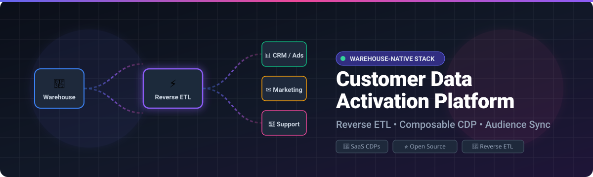
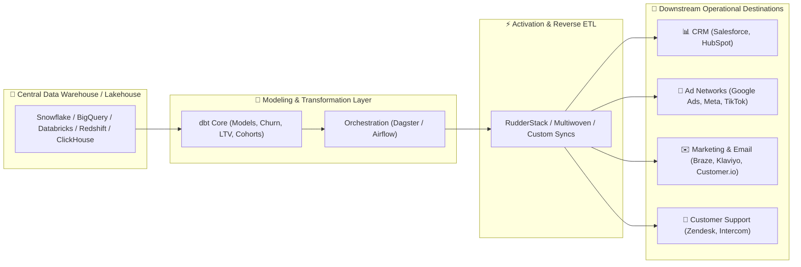

# Awesome Customer Data Activation Platform 🚀

 
 

 

**Curated list of leading SaaS Customer Data Platforms (CDPs), Reverse ETL tools, and Open-Source Data Activation solutions.**

*Operationalize your customer data warehouse, sync audiences in real-time to CRMs, ad platforms, and marketing tools.*

[Explore SaaS Platforms](#-saashosted-platforms) • [Explore Open-Source](#-open-source-github-projects) • [Architecture Guide](#-frameworks-for-custom-activation-systems) • [Contribute](#-how-to-contribute)

---

## 📖 Overview

**Customer Data Activation** is the discipline and architecture of transforming modeled warehouse data (from Snowflake, BigQuery, Databricks, Redshift, ClickHouse, PostgreSQL) into actionable customer profiles, traits, and audiences synced directly into operational SaaS tools (Salesforce, HubSpot, Braze, Google Ads, Facebook Ads, Zendesk, Marketo, and more).

Whether you are seeking full-featured **enterprise CDP suites**, agile **Reverse ETL** connectors, or **self-hosted open-source stacks**, this repository serves as your comprehensive reference guide.

---

## 📑 Table of Contents

- [🏢 SaaS/Hosted Platforms](#-saashosted-platforms)
- [💻 Open-Source GitHub Projects](#-open-source-github-projects)
- [🏗️ Frameworks for Custom Activation Systems](#-frameworks-for-custom-activation-systems)
- [🤝 How to Contribute](#-how-to-contribute)
- [⭐ Star History](#-star-history)
- [⚖️ Disclaimer](#-disclaimer)

---

## 🏢 SaaS/Hosted Platforms

The table below catalogs premier Customer Data Activation and Composable CDP platforms, sorted by **Company Size / Valuation / Revenue** in descending order.

| Product | Description | Company Size / Valuation / Revenue | Starting Price | Free Tier / Trial Limits |
| :--- | :--- | :--- | :--- | :--- |
| **[Segment (Twilio Segment)](https://segment.com/)** | Industry-standard CDP for omni-channel customer event capture, real-time identity resolution (Personas / Profiles), and downstream syncs to hundreds of tools including Reverse ETL. | **~$34.07B Market Cap** (Parent: Twilio NYSE: TWLO, ~$5.57B TTM Revenue) | **$120/month** (Team plan) | **Free forever plan**: Up to 1,000 MTUs (Monthly Tracked Users), 2 source connections, and unlimited destinations. |
| **[Census (Fivetran Activations)](https://www.census.dev/)** | Pioneering warehouse-native Reverse ETL & data activation platform (acquired by Fivetran), providing strong audience segmentation and continuous sync governance. | **~$5.6B Valuation** (Parent: Fivetran, $300M+ ARR; Census previously valued at $630M) | **$0/month** (Usage-based paid plans start after free tier threshold) | **Free forever plan**: Up to 3,500 Activation MAR (Monthly Active Rows), 500,000 Connector MAR, and 5,000 model runs/month. |
| **[Hightouch](https://hightouch.com/)** | Leading warehouse-native Reverse ETL and Composable CDP suite syncing modeled cohorts, audiences, and traits to 250+ destinations with visual Customer Studio. | **~$2.75B Valuation** ($150M Series C led by Goldman Sachs & Bain Capital) | **$350/month** (Starter / self-serve tier) | **Free forever plan**: Up to 2 active syncs, hourly sync frequency, unlimited destinations & seats. |
| **[Treasure Data](https://www.treasuredata.com/)** | Enterprise-grade CDP powerhouse built for massive data unification, AI-driven customer journeys, and scalable operational activation across global enterprises. | **~$1.0B Valuation** (Spun out with $234M funding led by SoftBank; originally Arm-acquired) | **Custom enterprise pricing** (No Compute consumption model based on profiles and events) | **No free tier** (Offers complimentary bespoke Proof of Concept / POCs on custom data upon sales qualification). |
| **[mParticle](https://www.mparticle.com/)** | Unified customer data infrastructure focused on real-time mobile/web event ingestion, cross-device identity resolution, and multi-channel activation. | **~$300M Acquisition** (Acquired by Rokt in Jan 2025; raised $244M+ historically) | **Value-based pricing / Enterprise contract** (Credit-based consumption model) | **No free tier or public self-serve trial** (Evaluation via guided product demos and custom enterprise POCs). |
| **[RudderStack](https://www.rudderstack.com/)** | Warehouse-first customer data platform offering real-time event streaming, warehouse identity resolution, and Reverse ETL with strong developer tooling. | **~$300M Valuation** ($82M+ total funding raised, Series C in 2025) | **$265/month** (Growth plan) | **Free forever plan**: Up to 250,000 events/month, 5 transformations, reverse ETL included (plus 30-day Growth trial with 25M event cap). |
| **[ActionIQ](https://www.actioniq.com/)** | Enterprise composable and hybrid CDP tailored for secure, governed audience building, real-time activation, and advanced segmentation for Fortune 1000 brands. | **~$145M Acquisition** (Acquired by Uniphore in Dec 2024; previously raised $130M+) | **Enterprise contract** (Typically starting at ~$100,000+/year on annual contracts) | **No free tier or public self-serve trial** (Evaluation through technical discovery and tailored enterprise POCs). |
| **[Simon Data](https://www.simondata.com/)** | Connected customer data engine and marketing activation platform purpose-built for Snowflake, BigQuery, and Databricks to drive 1-to-1 personalization. | **~$123M Total Funding** ($54M Series D led by Macquarie Capital) | **Custom / Enterprise contract** (Annual contracts, typically starting at ~$50k+/year) | **No free tier or public self-serve trial** (Evaluation via custom scheduled product demos and guided enterprise pilots). |
| **[Zeotap](https://zeotap.com/)** | Privacy-first next-gen customer data and identity platform built specifically for GDPR/telecom compliance, identity graphs, and omni-channel audience activation. | **~$117M Total Funding** (Raised $25M extension in late 2024) | **Subscription-based enterprise contract** (Custom pricing by profiles and data volume) | **No free tier or self-serve trial** (Evaluation through personalized sales demos and discovery sessions). |
| **[Optimove](https://www.optimove.com/)** | Customer-led marketing automation and retention CDP combining predictive analytics, autonomous orchestration, and bi-directional activation. | **~$95M Total Funding** ($75M round led by Summit Partners; $100M+ valuation) | **~$4,000/month** (Enterprise subscription quotes based on database size & customer networks) | **No free tier or public free trial** (Evaluation via scheduled guided platform demos). |

---

## 💻 Open-Source GitHub Projects

Discover top open-source projects for reverse ETL, warehouse-native customer data infrastructure, self-hosted CDPs, and event collection engines. Ranked by **GitHub Star Count** in descending order.

| Project & Repo Link | Star Count | Primary Category | Description |
| :--- | :--- | :--- | :--- |
| **[PostHog](https://github.com/posthog/posthog)** |  | Product Analytics & Activation Suite | All-in-one open-source product analytics, session replay, feature flags, user cohorting, and webhook/destination data activation. |
| **[Airbyte](https://github.com/airbytehq/airbyte)** |  | ELT & Data Movement Engine | Industry-leading open data integration engine; powers ELT and custom destination pipelines for moving modeled warehouse data back into SaaS APIs. |
| **[Snowplow](https://github.com/snowplow/snowplow)** |  | Behavioral Data Engine & Pipeline | Enterprise-grade behavioral event collection, schema validation, and real-time enrichment engine feeding data warehouses and activation layers. |
| **[Jitsu](https://github.com/jitsucom/jitsu)** |  | Open-Source Segment Alternative | Fast, flexible data ingestion and event stream routing platform supporting cloud destinations, data warehouses, and webhooks. |
| **[RudderStack Server](https://github.com/rudderlabs/rudder-server)** |  | Warehouse-First CDP Core | Open-source enterprise event collection, transformation, and reverse ETL pipeline engine built specifically for modern cloud warehouses. |
| **[Tracardi](https://github.com/Tracardi/tracardi)** |  | Low-Code / API-First CDP | Open-source customer data platform for real-time profile management, workflow automation, segmentation, and rule-based activation. |
| **[Multiwoven](https://github.com/Multiwoven/multiwoven)** |  | Dedicated Open-Source Reverse ETL | Self-hosted, UI-driven Reverse ETL platform specifically built as an open-source alternative to Hightouch and Census. |
| **[LEO CDP](https://github.com/USPA-Technology/leo-cdp)** |  | AI-Driven Customer 360 CDP | Open-source customer data platform for single customer view unification, predictive scoring, personalization, and marketing automation. |
| **[Grouparoo](https://github.com/grouparoo/grouparoo)** |  | Reverse ETL Framework *(Archived)* | Groundbreaking open-source reverse ETL sync framework (archived, but valuable for reference sync architectures and declarative data models). |
| **[Valmi.io](https://github.com/valmi-io/valmi-activation)** |  | Cloud-Native Reverse ETL | Open-source data activation tool connecting data warehouses to ad platforms, CRMs, and ticketing systems. |

---

### 🔧 Developer Tooling & Building Blocks

- **[dbt Core](https://github.com/dbt-labs/dbt-core)**: The gold standard for modeling customer metrics, lifetime value (LTV), churn scores, and activation cohorts directly in SQL inside the data warehouse.
- **[Apache Airflow](https://github.com/apache/airflow)** / **[Dagster](https://github.com/dagster-io/dagster)** / **[Prefect](https://github.com/PrefectHQ/prefect)**: Orchestrate, schedule, and alert on custom Python/Go reverse ETL sync jobs and warehouse ELT cycles.
- **[DuckDB](https://github.com/duckdb/duckdb)**: High-performance embedded analytical SQL engine for rapid local trait generation and serverless audience syncs.
- **[Cube.js](https://github.com/cube-js/cube)**: Universal semantic layer for headless BI and consistent data definition feeding customer activation tools.

---

## 🏗️ Frameworks for Custom Activation Systems

Building a custom, composable customer data platform with open tools ensures total data ownership and zero vendor lock-in:

1. **Model First**: Model your audiences, RFM segments, and user traits in your data warehouse with **dbt**.
2. **Orchestrate Reliably**: Trigger activation runs immediately upon upstream data pipeline completion using **Airflow**, **Dagster**, or **Prefect**.
3. **Sync Flexibly**: Deploy **Multiwoven**, **RudderStack**, or targeted API workers to sync fresh audiences to business tools.
4. **Maintain Warehouse Ownership**: Maintain your cloud data warehouse as the single, immutable source of truth for maximum governance and GDPR/CCPA compliance.

---

## 🤝 How to Contribute

We welcome contributions from the community! 

1. 🍴 Fork the repository.
2. 🌿 Create a new feature branch (`git checkout -b add-my-platform`).
3. 📝 Add or update entries in [README.md](file:///C:/Users/ishan/Documents/Projects/Awesome-Customer-Data-Activation-Platform/README.md) following the existing tabular format and criteria.
4. 🚀 Submit a detailed Pull Request.

---

## ⭐ Star History

---

## ⚖️ Disclaimer

- This is a community-curated directory intended for educational and architectural evaluation purposes.
- Customer data activation processes personally identifiable information (PII). Ensure proper privacy governance, user consent protocols, encryption, and regulatory compliance (GDPR, CCPA, HIPAA) before syncing data.

---

**[Awesome Customer Data Activation Platform](https://github.com/ishandutta2007/Awesome-Customer-Data-Activation-Platform)** • Maintained by [ishandutta2007](https://github.com/ishandutta2007)

*Let's make customer data activation more open, warehouse-native, and composable.*

